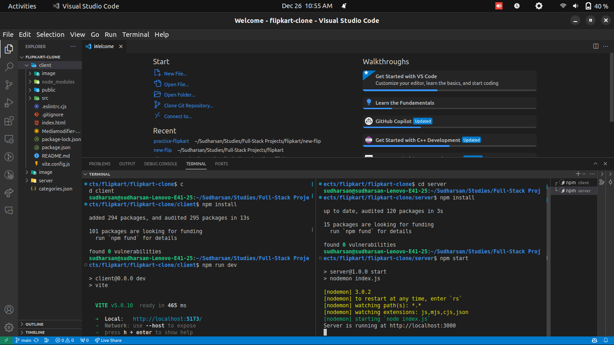
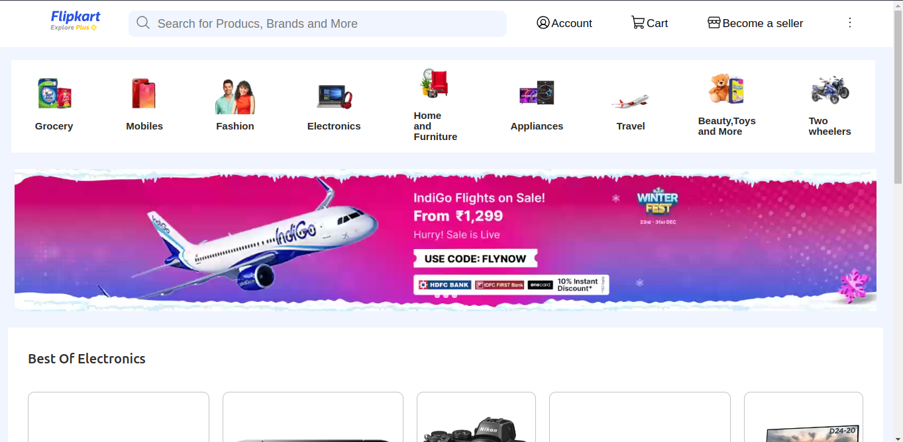
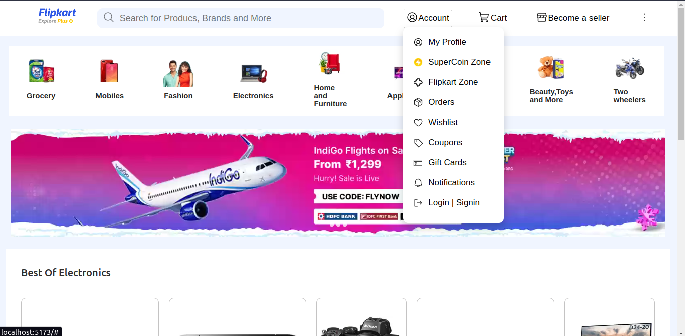
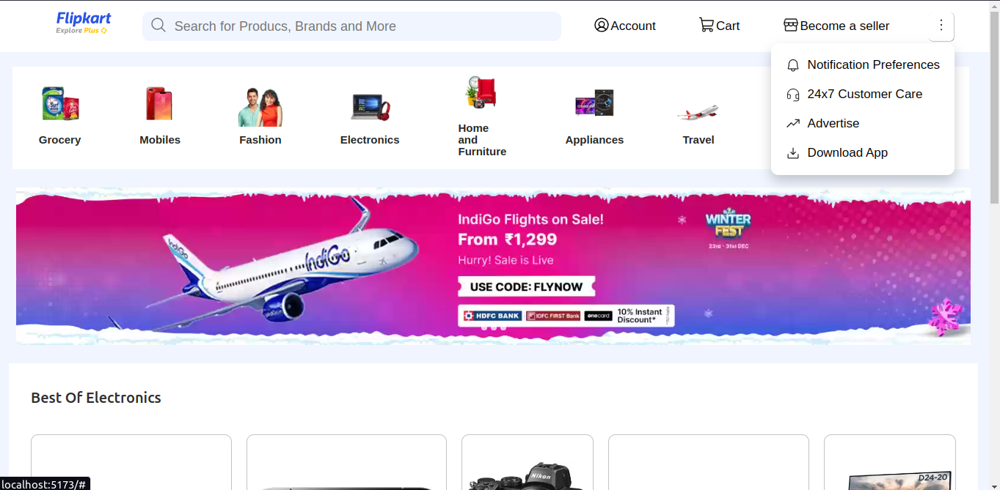
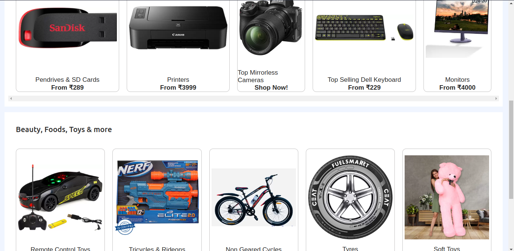
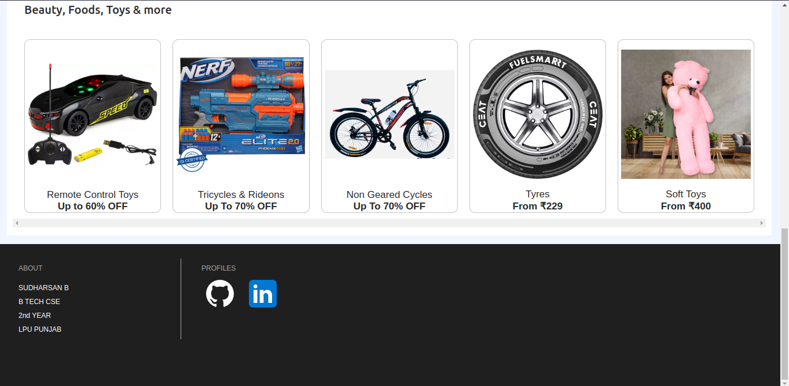
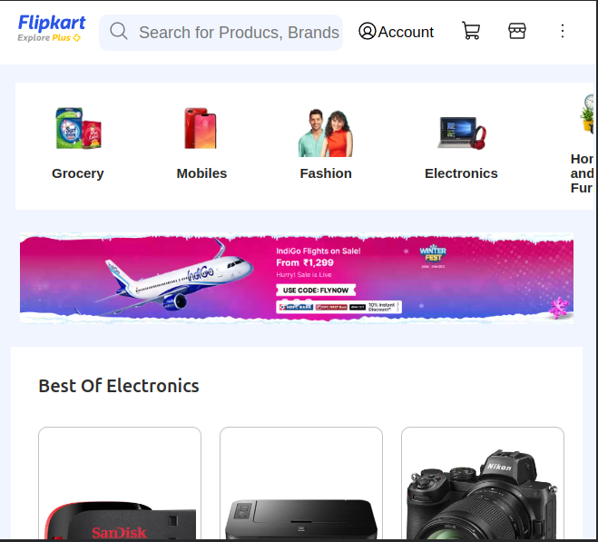
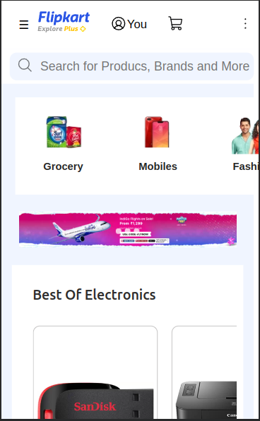
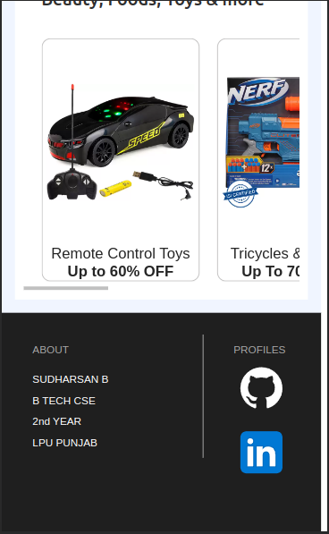

# Flipkart Clone Project

## Description

This project is a frontend-clone of the popular e-commerce platform Flipkart. It replicates key features and functionalities to provide a similar user experience.
Primary Goal of this project is to understand concepts of communcation between client server and backend server 
    <br>
    <br>
    - Understand basic GET method operations<br>
    - Understand the basics of mongoose module operations(Connection,Create Schema) in node server <br>
    - Understand the basics of React elements (UseState,UseEffect,BrowserRouter,Routes)<br>
## Features

- **Categories:** Display various product categories.
- **Search:** Search for products, brands, and more.
- **User Account:** View orders, wishlist, rewards, and manage profile.
- **Shopping Cart:** Add products to the cart and proceed to checkout.
- **Seller Interface:** Become a seller and manage your store.

## Technologies Used

- **Frontend:** React
- **Backend:** Node.js, Express.js
- **Database:** MongoDB
- **Styling:** CSS
- **API Communication:** Axios

## Getting Started

1. Clone the repository.
    ```bash

    git clone https://github.com/25sudharsan27/flipkart-clone.git

2. install dependencies for both the client server and backend server.
    ```bash
    cd flipkart-clone
    cd client && npm install - first Terminal 
    cd server && npm install - Second Terminal

3. Set up MongoDB and configure the connection in the backend.

    Add the categories.json File in mongodb compass in the database name: sample and collection: users

4. Run the backend server.
    ```bash

    cd server && npm start

5. Run the frontend server.
    ```bash
    cd client && npm run dev



6. Open your browser and navigate to http://localhost:5173 to view the application.

Folder Structure

- **Client**: Contains the React frontend application.
- **Server**: Contains the Node.js and Express.js backend server.
- **categories.json**: MongoDB NoSQL data for website flipkart-clone.
- **image** : Contains the screenshots of the clone-website


**Laptop Screenshots**
<br>
<br>



**Dropdowns** 





**Body and Footer**






**Tablet Screenshots**
<br>
<br>




**Mobile Screenshots**
<br>
<br>



